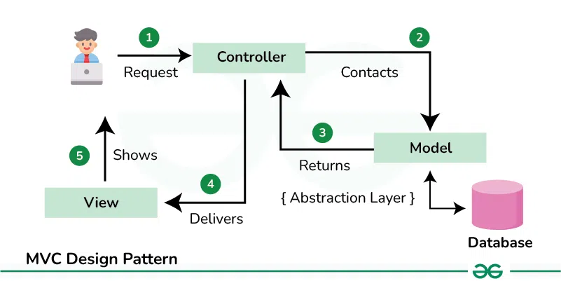

# <strong> Social Network </strong>

#### <span style="color:royalblue">License</span>


#### <span style="color:limegreen">Project Status</span>


#### <span style="color:royalblue">Badges</span>


#### <span style="color:antiquewhite">GitHub Stats</span>


---

#### Table of Contents
<details>
<span id="top"></span>
<summary><strong></strong><span style="color:limegreen">Click to expand</span><strong></strong></summary>

- [Overview](#social-network-api-overview)
    - [Architecture](#architecture)
- [Features](#features)
  - [User Management](#user-management)
  - [Thoughts (Posts)](#thoughts-posts)
  - [Reactions (Likes/Comments)](#reactions-likescomments)
  - [MongoDB Storage](#mongodb-storage)
  - [REST API](#rest-api)
- [Tech Stack](#tech-stack)
  - [Backend](#backend)
  - [Database](#database)
  - [Development Tools](#development-tools)
- [Project Structure](#project-structure)
  - [API Routes Documentation](#api-routes-documentation)
  - [Friend Routes](#friend-routes)
  - [Thought Routes](#thought-routes---api-thoughts)
  - [User Routes](#user-routes---api-users)
  - [Reactions Routes](#reactions-routes---api-reactions)
  - [How to Use These Routes in Postman](#how-to-use-these-routes-in-postman)
- [Setup & Installation Guide](#setup--installation-guide)
  - [Prerequisites](#prerequisites)
  - [Clone the Repository](#clone-the-repository)
  - [Install Dependencies](#install-dependencies)
  - [Configuration](#configuration)
  - [Running the Application](#running-the-application)
  - [Testing the API](#testing-the-api)
  - [Seeding the Database](#seeding-the-database)
  - [Development](#development)
  - [Packaging](#packaging)
- [License](#license)
- [Contact](#contact)
- [Video Walkthrough](#video-walkthrough)
- [Future Enhancements](#future-enhancements)

</details>

## Social Network API Overview

The **Social Network API** is a backend system designed to manage social interactions such as user accounts, posts, comments, likes, and friend connections. It follows a **RESTful API** structure, enabling efficient communication between clients and the server.

### Architecture
This project follows the **Model-View-Controller (MVC)** architecture to ensure a well-organized and maintainable codebase:

1. **Model (M)** – Defines the data structure and relationships, ensuring consistency and validation.
2. **Controller (C)** – Handles the business logic, processes incoming requests, and interacts with the database.
3. **View (V)** – Since this is a backend-only system, JSON responses serve as the "view," delivering structured data to the client.

By structuring the API with **MVC**, the project remains modular, scalable, and easy to extend. New features can be integrated seamlessly, and debugging becomes more manageable with clear separation between data models, business logic, and routing.



Photo Credit - [Geeks-for-Geeks.org](https://www.geeksforgeeks.org/mvc-design-pattern/)

<div style="text-align: right;">
  <a href="#top">
    
  </a>
</div>

## Features
- <span id="user-management">**User Management**</span>: Users can create, update, and delete accounts.
- <span id="thoughts-posts">**Thoughts (Posts)**</span>: Users can post thoughts, edit them, and remove them.
- <span id="reactions-likescomments">**Reactions (Likes/Comments)**</span>: Users can react to thoughts with reactions.
- <span id="mongodb-storage">**MongoDB Storage**</span>: Uses Mongoose to store user data, thoughts, and reactions.
- <span id="rest-api">**REST API**</span>: Fully functional API that supports CRUD operations for users, thoughts, and reactions.

<div style="text-align: right;">
  <a href="#top">
    
  </a>
</div>

## Tech Stack
[](https://skillicons.dev)

- <span id="backend">**Backend**</span>: Node.js with Express.js
- <span id="database">**Database**</span>: MongoDB with Mongoose ORM
- <span id="development-tools">**Development Tools**</span>: TypeScript, Nodemon, Ts-Node

<div style="text-align: right;">
  <a href="#top">
    
  </a>
</div>

## Project Structure
```
┌── socialNetwork/
├── dist/
├── node_modules/
├── src
│   ├── config
│   │   └── connection.ts
│   ├── controllers
│   │   ├── friendController.ts
│   │   ├── reactionController.ts
│   │   ├── thoughtController.ts
│   │   └── userController.ts
│   ├── models
│   │   ├── friends.ts
│   │   ├── index.ts
│   │   ├── reactions.ts
│   │   ├── thoughts.ts
│   │   └── user.ts
│   ├── routes
│   │   ├── friendRoutes.ts
│   │   ├── index.ts
│   │   ├── reactionRoutes.ts
│   │   ├── thoughtRoutes.ts
│   │   └── userRoutes.ts
│   ├── seeds
│   │   └── seeds.ts
│   └── server.ts
├── .env
├── .gitignore
├── LICENSE
├── README.md
├── img_1.png
├── package.json
├── package-lock.json
└── tsconfig.json
```

<div style="text-align: right;">
  <a href="#top">
    
  </a>
</div>

# API Routes Documentation

This document outlines all available API routes, their methods, descriptions, and how they work.

---
### <span id="friend-routes">Friend Routes</span>
Handles operations related to friends.

| **Method** | **Route**            | **Description**                                      |
|-----------|----------------------|------------------------------------------------------|
| `GET`     | `/api/friends`       | Retrieve all users and their friends.               |
| `GET`     | `/api/friends/get`   | Retrieve a specific friend from a user's friend list. |
| `POST`    | `/api/friends/add`   | Add a friend to a user's friend list.               |
| `DELETE`  | `/api/friends/remove`| Remove a friend from a user's friend list.          |

### <span id="user-routes---api-users">**User Routes**</span>
Handles operations related to users.

| **Method**  | **Endpoint**         | **Description**           |
|------------|---------------------|---------------------------|
| **GET**    | `/api/users`         | Fetch all users           |
| **GET**    | `/api/users/:id`     | Fetch a single user by ID |
| **POST**   | `/api/users`         | Create a new user         |
| **PUT**    | `/api/users/:id`     | Update a user's details   |
| **DELETE** | `/api/users/:id`     | Delete a user             |
| **DELETE** | `/api/users`         | Delete all users          |


### <span id="thought-routes---api-thoughts">**Thought Routes**</span>
Handles operations related to thoughts.

| **Method**  | **Endpoint**         | **Description**          |
|------------|---------------------|--------------------------|
| **GET**    | `/api/thoughts`      | Fetch all thoughts       |
| **GET**    | `/api/thoughts/:id`  | Fetch a thought by ID    |
| **POST**   | `/api/thoughts`      | Create a new thought     |
| **PUT**    | `/api/thoughts/:id`  | Update a thought        |
| **DELETE** | `/api/thoughts/:id`  | Delete a thought        |


### <span id="reactions-routes---api-reactions">**Reactions Routes**</span>
Handles operations related to reactions.

| **Method**  | **Endpoint**                                     | **Description**             |
|------------|-------------------------------------------------|-----------------------------|
| **GET**    | `/api/reactions`                                | Fetch all reactions         |
| **GET**    | `/api/reactions/:id`                            | Fetch a reaction by ID      |
| **POST**   | `/api/reactions`                                | Create a new reaction       |
| **PUT**    | `/api/reactions/:id`                            | Update a reaction          |
| **DELETE** | `/api/reactions/:id`                            | Delete a reaction          |
| **POST**   | `/api/reactions/:reactionId/reactions`          | Add a sub-reaction         |
| **DELETE** | `/api/reactions/:reactionId/reactions/:id`      | Remove a sub-reaction      |

### **Usage**
Each route follows RESTful principles and is used for managing users, thoughts, reactions, and friendships within **SocialNetwork**.

<div style="text-align: right;">
  <a href="#top">
    
  </a>
</div>

---

## **How to Use These Routes in Postman**
1. **Set the Base URL:**
   - If running locally, use `http://localhost:<your-port>/api/`
   - Example: `http://localhost:3000/api/thoughts/`
2. **Use Appropriate Methods (GET, POST, PUT, DELETE).**
3. **For POST & PUT Requests:**
   - Select **"Body" → "raw"** → Choose **JSON format**.
   - Example for creating a user:
     ```json
     {
       "username": "User123",
       "email": "example@example.com",
       "password": "password123",
       "name": "Name",
       "friends": []
     }
     ```
4. **For Requests with URL Parameters:**
   - Example: `GET http://localhost:3000/api/thoughts`


<div style="text-align: right;">
  <a href="#top">
    
  </a>
</div>

---

###### **Note:** Ensure your server is running before testing the routes.


# Setup & Installation Guide

This section provides step-by-step instructions for setting up and running the **socialNetwork** project locally.


### **Prerequisites**
Before you begin, ensure you have the following installed on your machine:
- **Node.js** (v18+ recommended) – [Download Here](https://nodejs.org/)
- **MongoDB** (Ensure the database is running) – [Download Here](https://www.mongodb.com/try/download/community)
- **Postman** (for testing API requests) – [Download Here](https://www.postman.com/)

<div style="text-align: right;">
  <a href="#top">
    
  </a>
</div>

---
### **Clone the Repository**
To get started, clone the project from GitHub:
```bash
    git clone git@github.com:nathangreen1632/socialNetwork.git
```
Navigate to the project directory:
```bash
    cd socialNetwork
```

---

### Install Dependencies
Install all necessary dependencies by running:
```bash
    npm install
```

This will install all dependencies listed in the `package.json` file.


### **Configuration**
Ensure your MongoDB server is running. You can start it using:
```bash
    mongod
```

---

### **Running the Application**
To start the server, run:
```bash
    npm start
```
The server will start, and you should see a message indicating that it is running.

---

### **Testing the API**
Use **Postman** to test the API endpoints. Refer to the [API Routes Documentation](#api-routes-documentation) for details on available endpoints and how to use them.

---

### **Seeding the Database**
To populate the database with initial data, run:
```bash
    npm run seed
```
This will execute the seed script, populating the database with sample users and thoughts.

---

### **Development**
For development purposes, you can use:
```bash
    npm run dev
```
This command will start the server in development mode, with hot-reloading enabled.

---

### **Packaging**

To package the application for deployment, use:
```bash
    npm run build
```
This will compile the TypeScript code into JavaScript and place it in the `dist` directory.

<div style="text-align: right;">
  <a href="#top">
    
  </a>
</div>

---

## **License**

This project is licensed under the MIT License. See the [LICENSE](LICENSE) file for details.

<div style="text-align: right;">
  <a href="#top">
    
  </a>
</div>

---

## **Contact**

For any questions or support, feel free to reach out to the project maintainer:

- GitHub: [Nathan Green](http://www.github.com/nathangreen1632)
- Stack Overflow: [Nathan Green](https://stackoverflow.com/users/27279774/nathan)
- LinkedIn: [Nathan Green](https://www.linkedin.com/in/jgreen1632/)

<div style="text-align: right;">
  <a href="#top">
    
  </a>
</div>

---

## **Video Walkthrough**

[](https://www.youtube.com/watch?v=your-video-id)

## Future Enhancements
- Add **user authentication** (JWT-based login/logout)
- Implement **pagination** for large datasets
- Add **rate limiting** to prevent API abuse
- Improve **error handling** and validation

<div style="text-align: right;">
  <a href="#top">
    
  </a>
</div>

---
This API serves as the backend for a simple social networking platform, allowing users to interact with each other through thoughts and reactions. Built with scalability and maintainability in mind, it can be further expanded with new features in future iterations.

<div style="text-align: right;">
  <a href="#top">
    
  </a>
</div>
